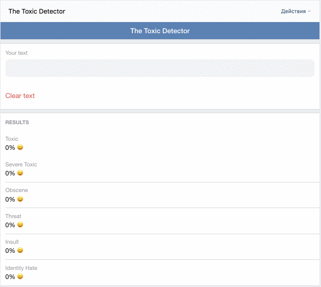

## What is this about?
This is a VK apps + tensorflow-js demo app that detects toxic texts

## Model

The model is a simple Convolutional Neural Network based on GloVe word embeddings; 

More info (and a keras model): https://github.com/deepvk/shark

## Live Demo

* In VK: https://vk.com/app6759433
* On GitHub Pages: https://VKCOM.github.io/vk-apps-tensorflow-example/

## How to start

`yarn start` || `npm start` — this will start dev server with hot reload on `localhost:10888`.

`yarn run build` || `npm run build` — this will build production bundle, with treeshaking, uglify and all this modern fancy stuff
